# Um Benchmark Reprodutível do Apache IoTDB, InfluxDB e TimescaleDB para Cargas de Trabalho IoT

Slides para defesa do TCC2 — 20 a 30 minutos
Formato sugerido: Marp / Reveal.js / PowerPoint
Imagens em: `../tcc2-latex/figures/pt_br/`
Deisgns em: https://getdesign.md/

---

## Slide 1 — Capa
*[~1 min]*

**Título:** Um Benchmark Reprodutível do Apache IoTDB, InfluxDB e TimescaleDB para Cargas de Trabalho IoT

- Luiz Fernando Klein
- Curso de Ciência da Computação — UFFS
- Chapecó, 2026
- Orientador: [nome do orientador]

---

## Slide 2 — Agenda
*[~0.5 min]*

1. Contexto e motivação
2. O que são Bancos de Dados de Séries Temporais?
3. Trabalhos relacionados e lacuna de reprodutibilidade
4. Objetivo e questões de pesquisa
5. Metodologia
6. Resultados
7. Achados principais e conclusão
8. Limitações e trabalhos futuros

---

## Slide 3 — Contexto: Explosão IoT
*[~1.5 min]*

- Dispositivos IoT crescem exponencialmente: Cisco projeta 500 bilhões de dispositivos conectados até 2030
- Sensores industriais, veículos, saúde, cidades inteligentes: todos geram fluxos contínuos de dados temporais
- O que antes levava 10 min para ser coletado hoje é gerado a cada segundo

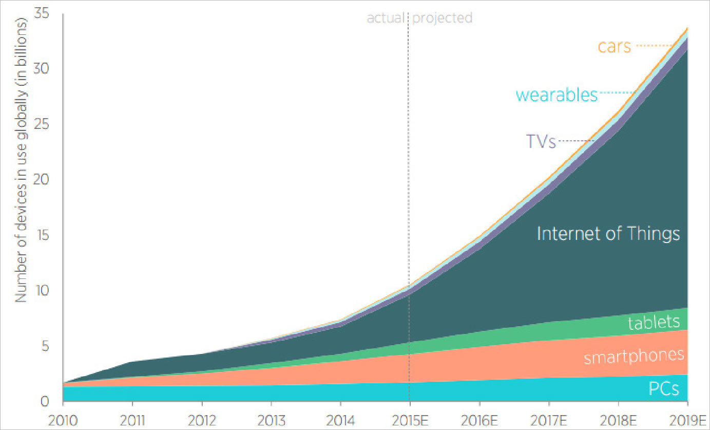

---

## Slide 4 — O Problema: Dados Temporais em Escala
*[~1.5 min]*

- Dados de séries temporais: sequências de medições indexadas pelo tempo, geralmente com precisão de milissegundos
- Bancos relacionais tradicionais sofrem com: indexação ineficiente, alto custo de armazenamento histórico, falta de funções temporais nativas
- BDSTs foram criados especificamente para este problema

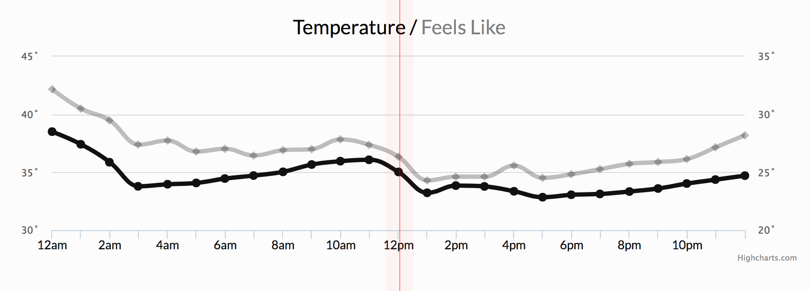
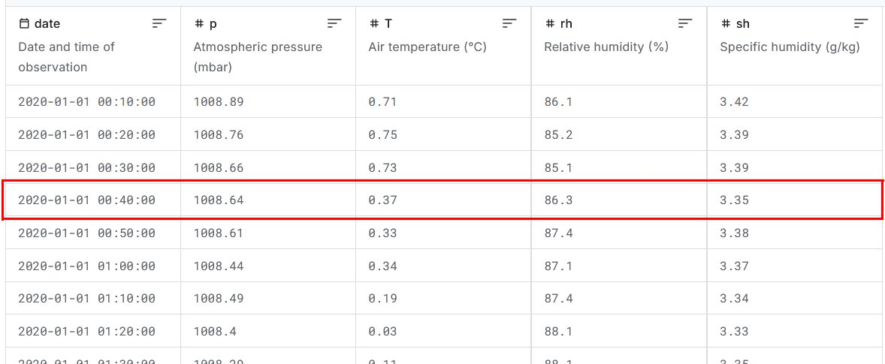

---

## Slide 5 — Os Três Bancos Avaliados
*[~2 min]*

| Banco | Arquitetura | Destaque |
|-------|-------------|----------|
| **Apache IoTDB 1.3** | TsFile colunar + Thrift RPC | Criado para IoT industrial (Tsinghua) |
| **InfluxDB 2.7** | TSM (Time-Structured Merge Tree) + HTTP | Padrão de referência na literatura |
| **TimescaleDB (PG 15)** | Hipertabelas sobre PostgreSQL + WAL | SQL completo + ecossistema relacional |

- Cada um representa uma abordagem arquitetural distinta
- Selecionados por proeminência nos estudos comparativos recentes

---

## Slide 6 — Trabalhos Relacionados: Lacuna de Reprodutibilidade
*[~1.5 min]*

- 5 estudos comparativos recentes analisados (Naqvi 2017, Shah 2022, Lima 2024, Wang 2023, Pereira 2023)
- Apenas **1 de 5** publicou scripts e configurações suficientes para replicação independente
- Problemas comuns: configurações descritas em prosa vaga, sem versões fixadas, ferramentas com acesso institucional restrito
- **Sem reprodutibilidade: resultados não podem ser validados nem comparados entre estudos**

---

## Slide 7 — Objetivo e Questões de Pesquisa
*[~1 min]*

**Objetivo:** Comparação controlada e reprodutível dos três BDSTs em cargas de trabalho IoT realistas

**Questões respondidas:**
- Qual banco tem maior vazão de escrita e como ela escala?
- Quais são as latências de leitura e como crescem com o volume?
- Quais escolhas arquiteturais explicam as diferenças?
- As escolhas metodológicas do benchmark afetam os resultados?

---

## Slide 8 — Metodologia: 9 Testes × 3 Escalas
*[~1.5 min]*

**Testes de escrita (4):** sequencial, fora de ordem, lote pequeno (B=1), lote grande (B=1000)

**Testes de leitura (5):** último valor, subamostragem, intervalo de tempo, filtro de valor, leitura geral

**Escalas:**
| Escala | Clientes | Dispositivos | Sensores | Dados totais |
|--------|----------|--------------|----------|--------------|
| Pequena | 5 | 10 | 10 | ~50k pts |
| Média | 5 | 10 | 10 | ~250k pts |
| Grande | 10 | 50 | 20 | ~5M pts |

---

## Slide 9 — Metodologia: Infraestrutura Reprodutível
*[~1.5 min]*

- **Docker Compose** com versões de imagem fixadas: cada banco sobe e desce isoladamente — apenas um ativo por vez
- **Python CLI** (`benchmark.py`): orquestra todos os 27 testes com um único comando
- **Nix flake**: ambiente declarativo e reprodutível (Java 17, Maven, Python 3, Docker)
- Disponível em: `github.com/LuizFerK/iot-benchrunner`

```
python3 benchmark.py --scale large
```

---

## Slide 10 — Resultados: Vazão de Escrita
*[~2 min]*

**Escala pequena (ajustada):**
- IoTDB: 2,2 M pts/s
- InfluxDB: 397 K pts/s
- TimescaleDB: 174 K pts/s

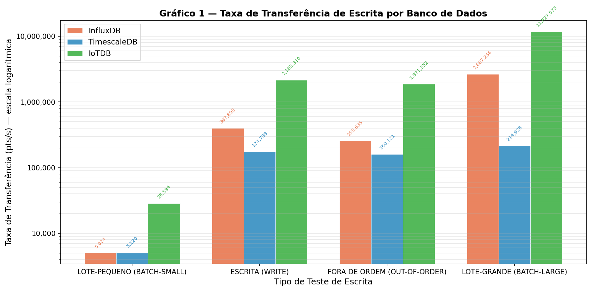

**Crescimento com o volume de dados:**

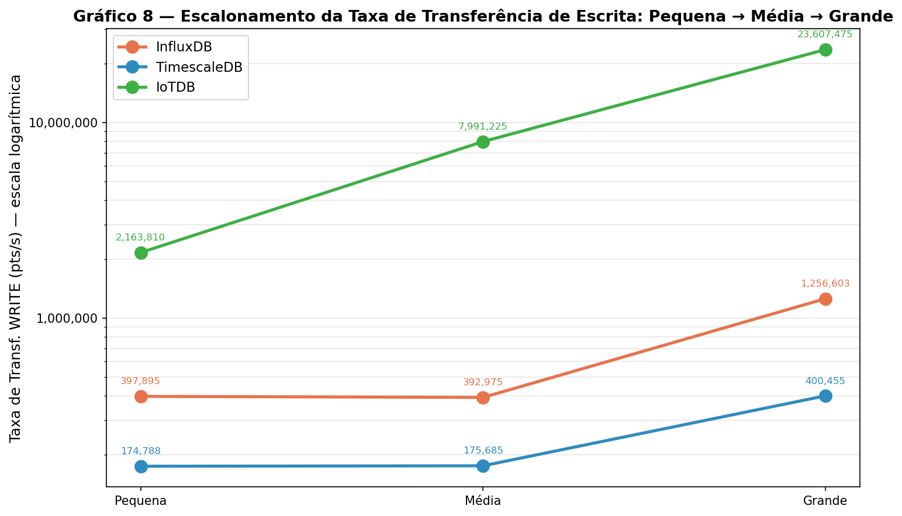

---

## Slide 11 — Resultados: Escrita Fora de Ordem
*[~1.5 min]*

- 20% dos dados chegam com atraso (distribuição de Poisson)
- **IoTDB:** penalidade de −13% — melhor tolerância absoluta e relativa
- **InfluxDB:** penalidade de −36% — TSM sofre com reescrita de segmentos
- **TimescaleDB:** penalidade de apenas −8% — WAL absorve bem a reordenação

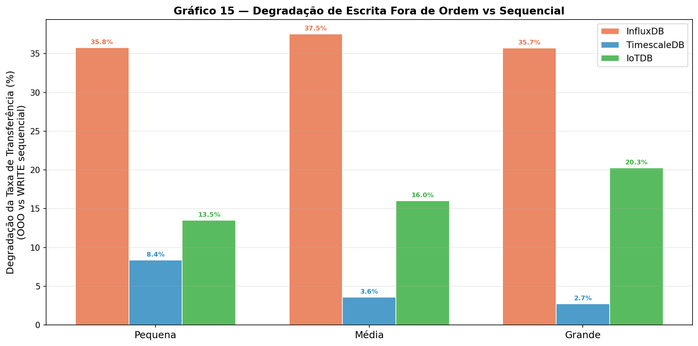

---

## Slide 12 — Resultados: Leitura — Último Valor
*[~1.5 min]*

- Padrão crítico em monitoramento IoT: "qual é a leitura atual do sensor X?"
- **TimescaleDB:** 0,38 ms (escala pequena) — índice reverso do PostgreSQL
- **IoTDB:** 1,24 ms — cresce moderadamente
- **InfluxDB:** 9,24 ms — cresce linearmente com os arquivos TSM armazenados (sem atalho de último valor em memória)

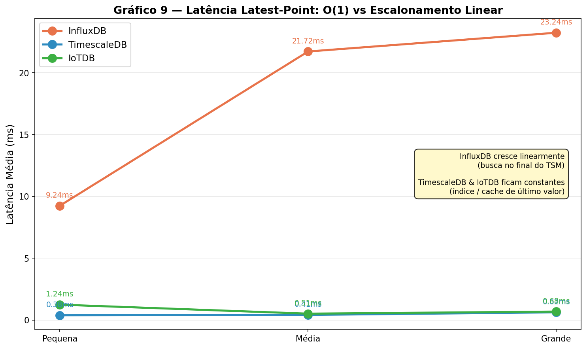

---

## Slide 13 — Resultados: Filtro de Valor
*[~1.5 min]*

- Padrão de alerta por limiar: "leituras acima de X nos últimos N dias"
- **IoTDB:** 3,72 ms (pequena) → 19,4 ms (grande) — crescimento **sublinear** graças às estatísticas de mín/máx por bloco (eliminação de blocos)
- **InfluxDB:** 71 ms → 497 ms
- **TimescaleDB:** 24 ms → 510 ms — cresce quase linearmente

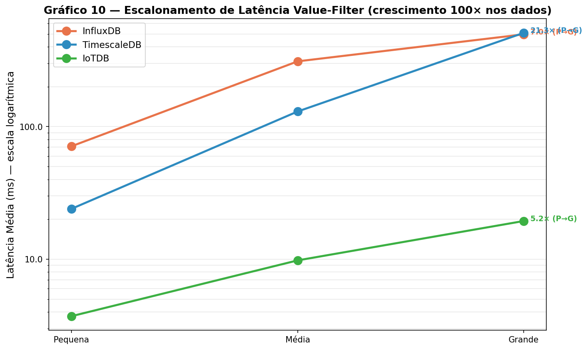

---

## Slide 14 — Resultados: Footprint de Memória
*[~1.5 min]*

- **IoTDB:** inicia em ~1,7 GB, estabiliza em ~10–15 GB — heap da JVM + buffers em memória
- **InfluxDB:** ~190 MB inicial, ~900 MB estável — mais eficiente
- **TimescaleDB:** ~239 MB inicial, ~1,8 GB estável — shared_buffers do PostgreSQL

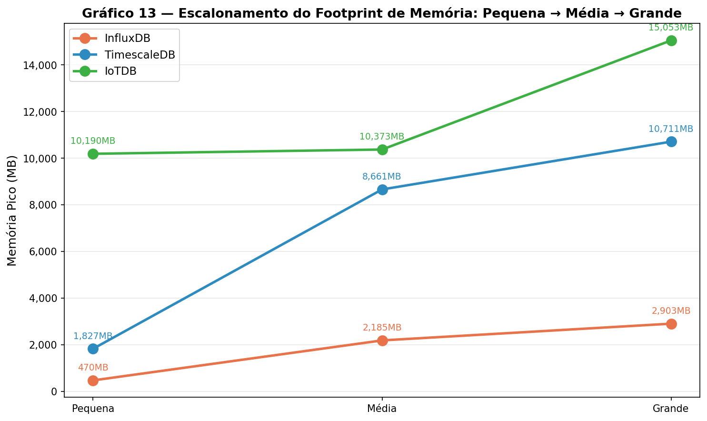

---

## Slide 15 — Descoberta Metodológica: Artefatos de Benchmark
*[~2 min]*

**Dois resultados das execuções iniciais foram revertidos por reexecuções isoladas:**

| Resultado inicial | Reexecução isolada |
|-------------------|--------------------|
| Penalidade fora de ordem TimescaleDB (grande): **23%** | **2,7%** — artefato de despejo de cache |
| Saturação de CPU TimescaleDB: **97,7%** | **77,4%** — competição de CPU compartilhada |

- Medições de memória mudaram em **uma ordem de magnitude** ao corrigir o ciclo de vida compartilhado dos contêineres

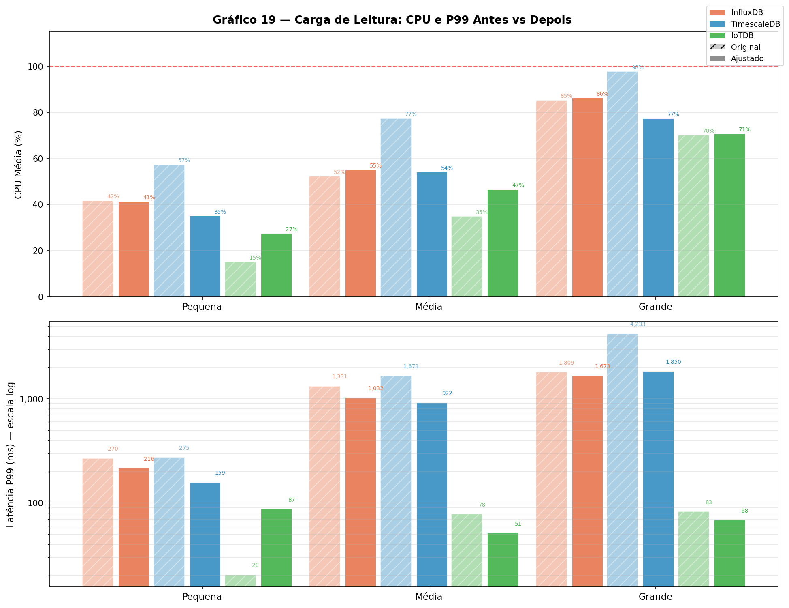

---

## Slide 16 — Visão Geral: Heatmap de Latência
*[~1.5 min]*

- Comparação multidimensional de todos os testes de leitura nos três bancos

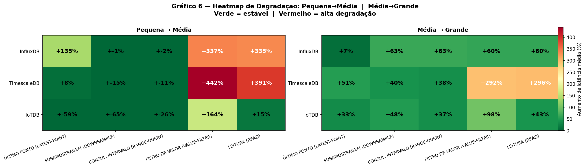

- Nenhum banco domina todas as dimensões
- Padrões de força e fraqueza emergem claramente

---

## Slide 17 — Os Três Achados Principais
*[~2 min]*

**1. Nenhum banco domina em todas as cargas de trabalho**
- IoTDB lidera escrita; TimescaleDB lidera subamostragem e último valor; InfluxDB equilibra

**2. Escolhas arquiteturais determinam o comportamento de escalonamento, não o ajuste**
- Vantagem do filtro de valor do IoTDB cresce com o volume (poda de blocos)
- Latência de último valor do InfluxDB cresce linearmente (sem atalho TSM)
- Subamostragem do TimescaleDB é genuinamente de latência constante (janela fixa)

**3. A metodologia afeta criticamente a validade do benchmark**
- Ambientes com recursos compartilhados produzem resultados enganosos
- Reexecuções isoladas são obrigatórias antes de apresentar propriedades arquiteturais

---

## Slide 18 — Guia de Seleção por Carga de Trabalho
*[~1.5 min]*

| Cenário | Banco recomendado |
|---------|-------------------|
| Pipeline IoT dominado por escrita com RAM suficiente | **IoTDB** |
| Análise com consultas de painel em janelas de tempo recentes | **TimescaleDB** |
| Alertas por limiar sobre histórico crescente | **IoTDB** (filtro sublinear) |
| Carga mista, memória restrita, volume moderado | **InfluxDB** |
| Necessidade de SQL, joins relacionais, ecossistema PostgreSQL | **TimescaleDB** |

---

## Slide 19 — Limitações e Trabalhos Futuros
*[~1 min]*

**Limitações:**
- Implantação em nó único (sem latência real de rede)
- Testes de leitura sequenciais (cache de páginas aquecido)
- Durabilidade diferida do IoTDB (reconhecimento em memória antes do disco)
- Aquecimento da JVM (benchmarks curtos subestimam o IoTDB)

**Trabalhos futuros:**
- Implantações distribuídas (IoTDB cluster, InfluxDB Clustered, TimescaleDB + Citus)
- Datasets do mundo real (telemetria veicular, redes elétricas, escala de bilhões de pontos)
- Overhead de durabilidade e alta disponibilidade (replicação, failover)
- Evolução de versões (IoTDB 2.x, InfluxDB 3.0 com motor colunar Arrow/DataFusion)

---

## Slide 20 — Obrigado
*[Perguntas]*

**Um Benchmark Reprodutível do Apache IoTDB, InfluxDB e TimescaleDB para Cargas de Trabalho IoT**

Luiz Fernando Klein — UFFS, 2026

Repositório público: `github.com/LuizFerK/iot-benchrunner`

- Scripts de orquestração, configurações Docker, ambiente Nix e dados de resultados disponíveis para replicação

*Perguntas?*
